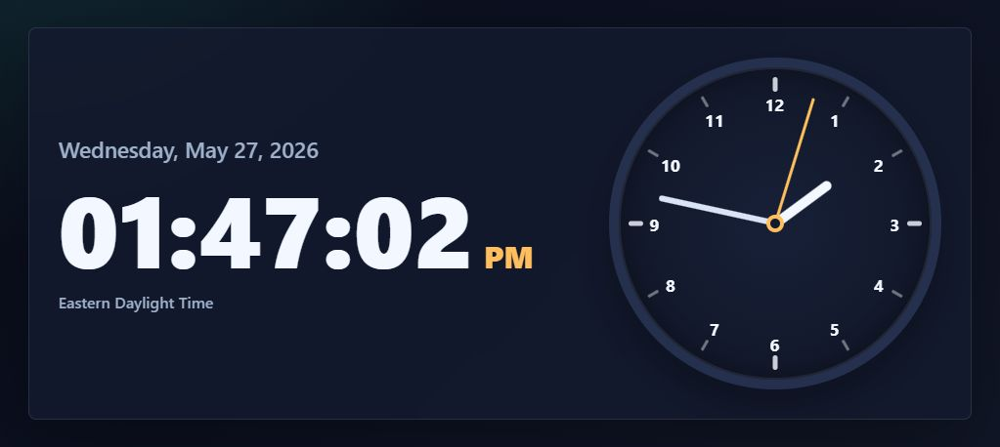

# Android Clock

Totally Vibe coded with Codex desktop, i do not know what i am doing

A small clock app with a responsive HTML clock face and a native Android WebView wrapper.



## Web Version

Open `index.html` directly in a browser, or serve the folder locally:

```powershell
python -m http.server 8080 --bind 127.0.0.1
```

Then visit `http://127.0.0.1:8080/`.

## Android Build

The Android project wraps the same HTML page in a WebView. The local build script copies the latest `index.html` into Android assets before building.

```powershell
powershell -ExecutionPolicy Bypass -File .\build-android.ps1
```

The debug APK is created at:

```text
app\build\outputs\apk\debug\app-debug.apk
```
